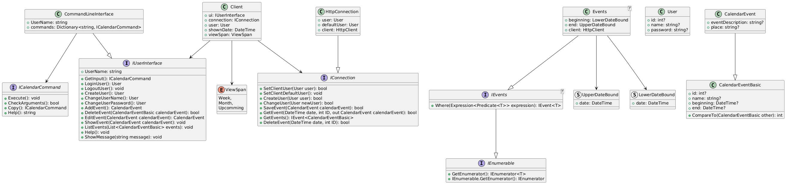
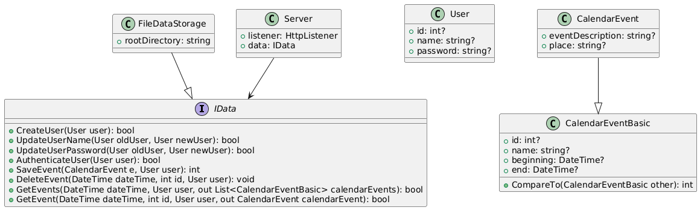

# Application Architecture Documentation # {#mainpage}

## Table of Contents

- Introduction

- Overall Architecture

- Client-Side Architecture
  
  - User Interface Layer
  - User Management Layer
  - Communication Layer

- Server-Side Architecture
  
  - Server Core Layer
  - Communication Layer
  - Data Storage Layer

## Introduction

The Application Architecture Documentation provides an overview of the design and structure of the application. It describes how the client and server components are organized, how they interact, and the overall flow of data and operations within the system.

## Overall Architecture

The application follows a client-server architecture, where clients interact with a central server to perform various tasks. The server manages user authentication and storing user and event data.

## Client-Side Architecture

{width=70%}

#### User Interface Layer

The User Interface (UI) layer is responsible for presenting information to users and capturing user inputs. It consists of a console-based interface that allows users to create accounts, sign in and create and handle events or change credentials.

#### User Management Layer

The User Management layer handles user authentication and account creation. Users can either sign in with existing accounts or create new accounts. This layer communicates with the server to verify credentials and manage user sessions.

#### Communication Layer

The Communication layer facilitates communication between the client and the server. It handles the serialization and deserialization of data using JSON and manages the Http comunication with the server.

## Server-Side Architecture

#### Server Core Layer

The Server Core layer forms the heart of the server-side architecture. It listens for incoming client requests and dispatches requests to appropriate handlers. The Server Core ensures smooth communication between clients and other server components.

#### Communication Layer

Similar to the client-side, the Communication layer on the server handles data serialization, deserialization, and Http communication. It ensures reliable data exchange between the server and clients. 

#### Data Storage Layer

The Data Storage layer handles the persistent storage of user accounts, manages saved events and authenticates users.